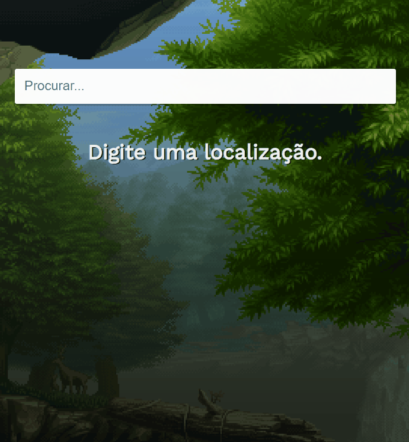

<h1 align="center">Aplicativo de Clima</h1>
<br>
<h1>Projeto de consulta de clima</h1>
<p>Desenvolvido em ReactJS com integração da API do OpenWeather.</p>

<h2>Tecnologias utilizadas</h2>
<ul>
    <li>HTML ✅</li>
    <li>CSS ✅</li>
    <li>ReactJS ✅</li>
</ul>

<h2> Imagem do projeto </h2>


<h2>Pré-requisitos</h2>
<p>Antes de começar, você vai precisar ter instalado as seguintes ferramentas:</p>
<ul>
    <li><a href="https://nodejs.org/pt-br/download/" target="_blank">Node.js</li>
    <li><a href="https://gitforwindows.org/" target="_blank">Git</li>
</ul>

<h2>Clone este repositório</h2>
```bash
$ git clone https://github.com/victordunaivits/weather-app.git
```

